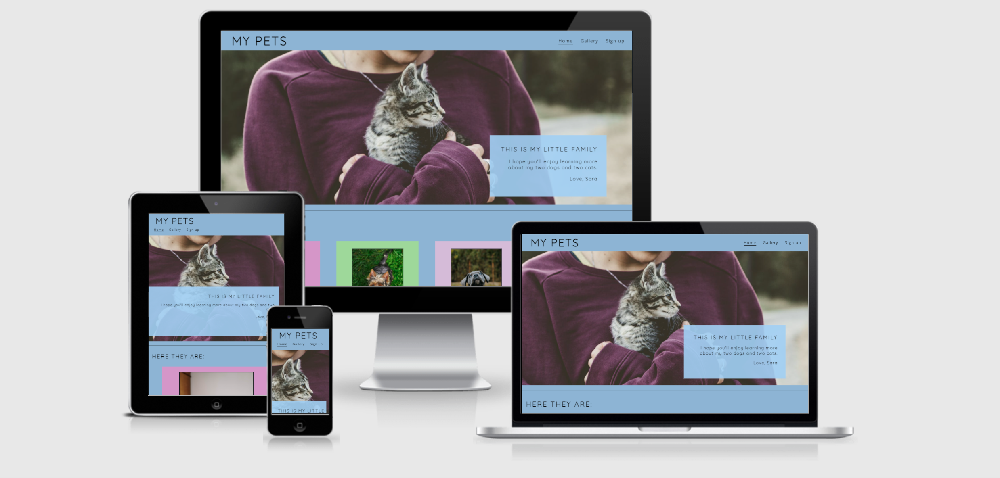
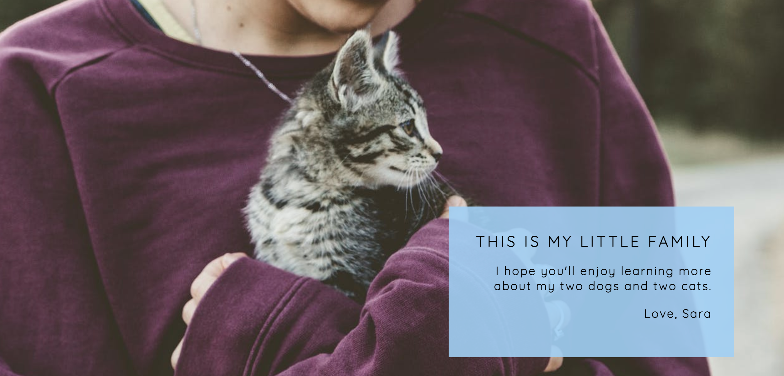
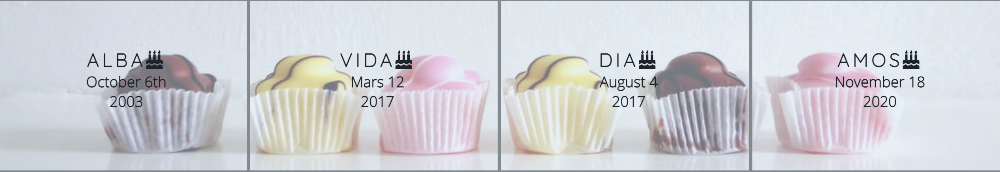
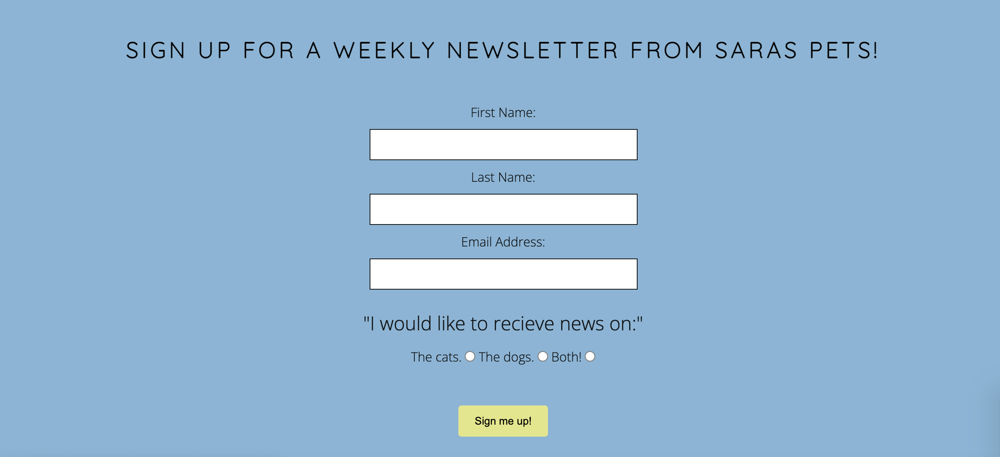
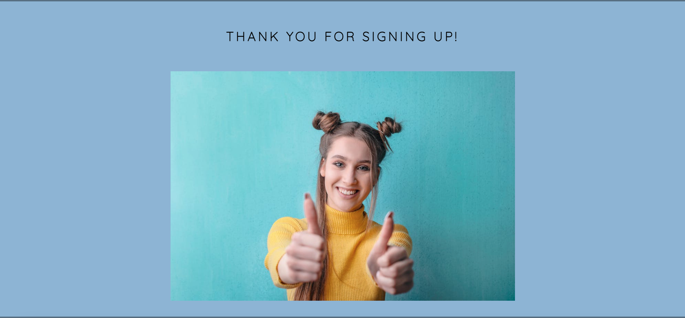
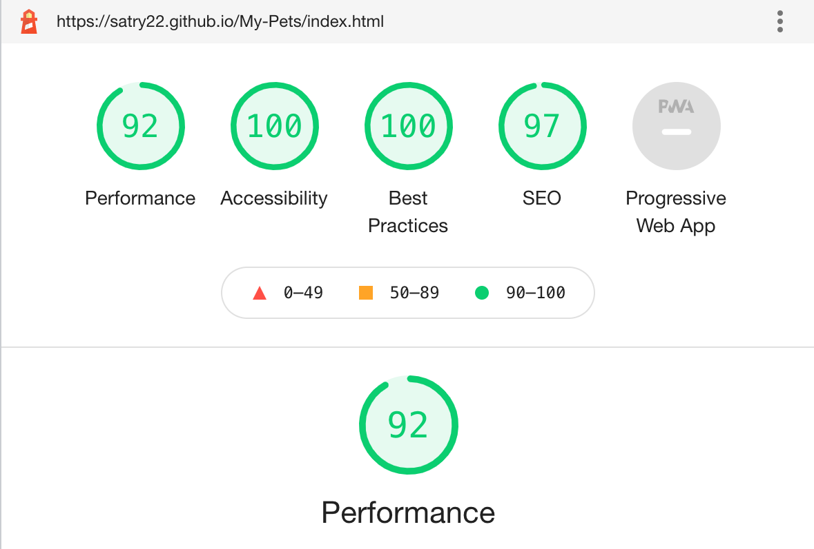

# Saras Pets

Saras Pets is at site to present my four pets, two dogs and two cats.
My friends and family love to follow them via social media, and this site is to give them, and new followers, an idea of who my pets are and where you can find out more about them.
Animals are wonderful creatures, and I love to share all the fun and sometimes not so fun things they are up to.

## Features 

- __Navigation Bar__

  - At the top of all four pages, the fully responsive navigation bar includes links to the Home page, the Gallery and a Sign Up page. It is identical in each page to allow for easy navigation.
  - This section will allow the user to easily navigate from page to page across all devices without having to revert back to the previous page via the ‘back’ button. 

- __The Header__

  - The main image is a photograph with text overlay to allow the user to briefly learn what the page is about. 
  - This section introduces the user to My Pets with an image of a little kitten.

- __All Pets__

  - This section present all the four pets. The user will learn a little bit about each personality.
  - This section will hopefully leave the user to want more.

- __Birtdays__

  - This section will allow the user to be reminded of when the pets birthdays are.  

- __The Footer__ 

  - The footer section includes links to social media sites for all the pets, viewing through the eyes of one of the dogs. The links will open to a new tab to allow easy navigation for the user. 
  - The footer is valuable to the user as it encourages them to keep connected via social media.

- __Gallery__

  - The gallery will provide the user with images to see what the newsletter and social media can look like. 
  - This section is valuable to the user as they will be able to easily identify the types of images posted on social media. 

- __The Sign Up Page__

  - This page will allow the user to get signed up to a weekly newsletter about the pets. The user will be able to choose if they want information on the dogs, the cats or both categories. The user will be asked to submit their full name and email address. 

- __The Thank You page__

- A thanks is given to the user as a confirmation on their signing up for the newsletter.

For some/all of your features, you may choose to reference the specific project files that implement them.
In addition, you may also use this section to discuss plans for additional features to be implemented in the future:

### Features Left to Implement

- A page for a contact information and -form.
- A page with a Facebook update.
- A blog.

## Testing 

### Validator Testing 

- HTML
  - No errors were returned when passing through the official [W3C validator](https://validator.w3.org/nu/?doc=https%3A%2F%2Fcode-institute-org.github.io%2Flove-running-2.0%2Findex.html)
- CSS
  - No errors were found when passing through the official [(Jigsaw) validator](https://jigsaw.w3.org/css-validator/validator?uri=https%3A%2F%2Fvalidator.w3.org%2Fnu%2F%3Fdoc%3Dhttps%253A%252F%252Fcode-institute-org.github.io%252Flove-running-2.0%252Findex.html&profile=css3svg&usermedium=all&warning=1&vextwarning=&lang=en#css)

  

### Unfixed Bugs

No bugs unfixed. 

## Deployment

- The site was deployed to GitHub pages. The steps to deploy are as follows: 
  - In the GitHub repository, navigate to the Settings tab 
  - From the source section drop-down menu, select the Main Branch
  - Once the main branch has been selected, the page will be automatically refreshed with a detailed ribbon display to indicate the successful deployment. 

The live link can be found here - https://satry22.github.io/My-Pets/index.html 

## Credits 

  - Google fonts Quicksand and Open Sans was used on the entire page.
  - AwesomeFonts provided icons to Social Media Links and Birthdays.
  - W3School has been used for instruction and ideas for the overall page.
  - Basic structure inspiration from Love Running project.
  - Tutorials from The Code Institute.

### Content 

- All content written by Sara Tryzell.

### Media

Images taken from :
Main Photo by Japheth Mast

Black cat Photo by cottonbro

Red cat Photo by Valeria Boltneva

Cane Corso Photo by Vlad Chețan

Yorkshire terrier Photo by Daria Rem

Birthdays Photo by David Jakab

Photo by Andrea Piacquadio

Congratulations on completing your Readme, you have made another big stride in the direction of being a developer! 

## Other General Project Advice

Below you will find a couple of extra tips that may be helpful when completing your project. Remember that each of these projects will become part of your final portfolio so it’s important to allow enough time to showcase your best work! 

- One of the most basic elements of keeping a healthy commit history is with the commit message. When getting started with your project, read through [this article](https://chris.beams.io/posts/git-commit/) by Chris Beams on How to Write  a Git Commit Message 
  - Make sure to keep the messages in the imperative mood 

- When naming the files in your project directory, make sure to consider meaningful naming of files, point to specific names and sections of content.
  - For example, instead of naming an image used ‘image1.png’ consider naming it ‘landing_page_img.png’. This will ensure that there are clear file paths kept. 

- Do some extra research on good and bad coding practices, there are a handful of useful articles to read, consider reviewing the following list when getting started:
  - [Writing Your Best Code](https://learn.shayhowe.com/html-css/writing-your-best-code/)
  - [HTML & CSS Coding Best Practices](https://medium.com/@inceptiondj.info/html-css-coding-best-practice-fadb9870a00f)
  - [Google HTML/CSS Style Guide](https://google.github.io/styleguide/htmlcssguide.html#General)

Getting started with your Portfolio Projects can be daunting, planning your project can make it a lot easier to tackle, take small steps to reach the final outcome and enjoy the process! 

