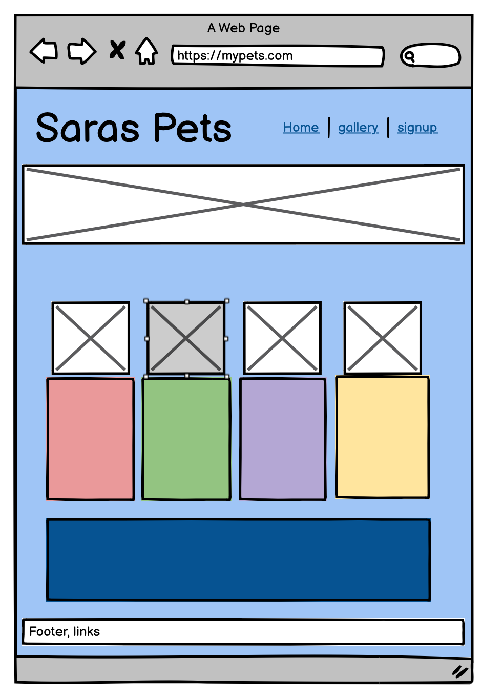
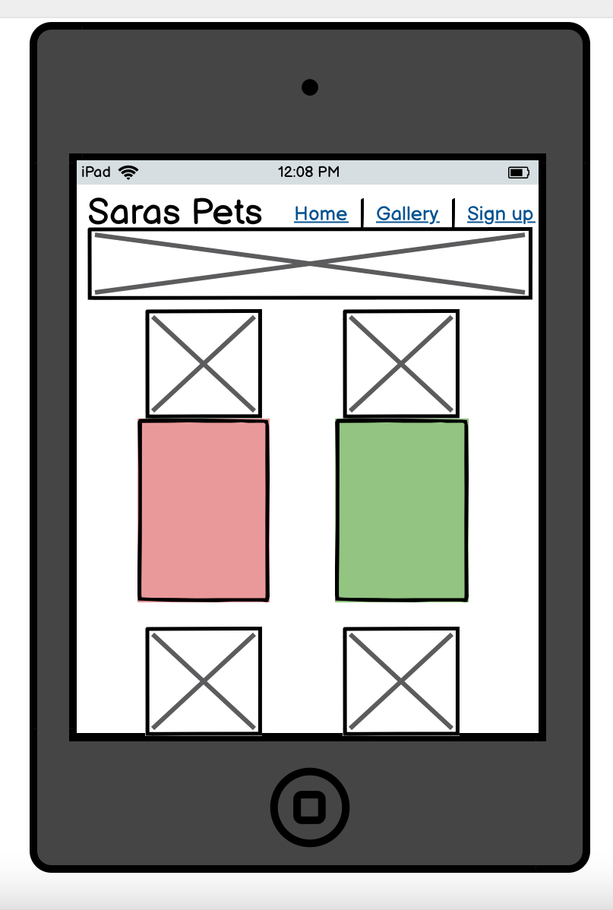
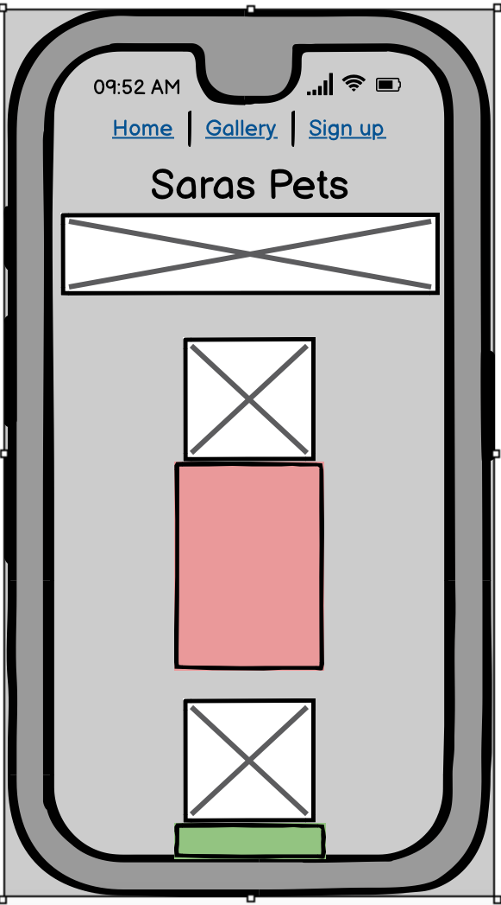
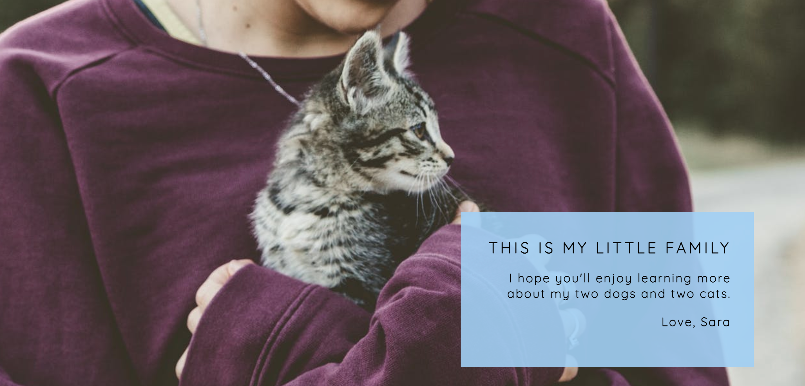
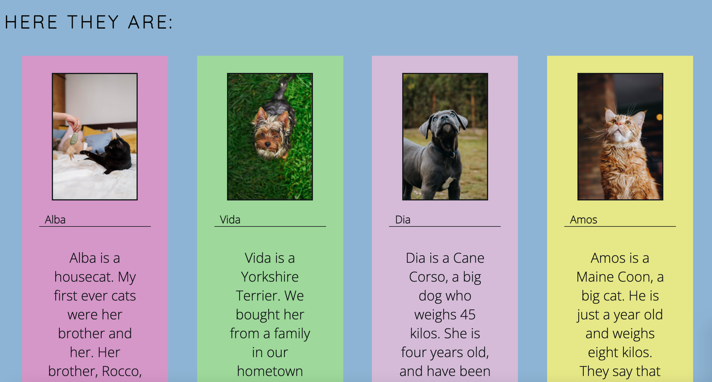
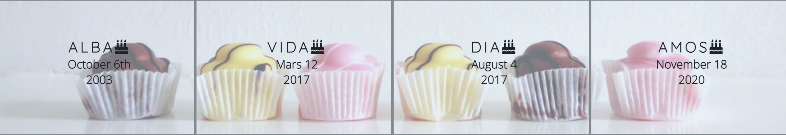
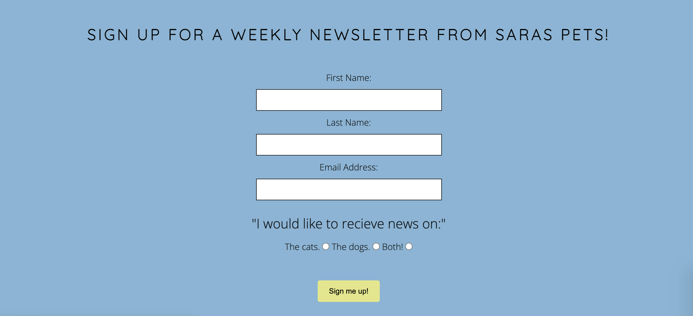
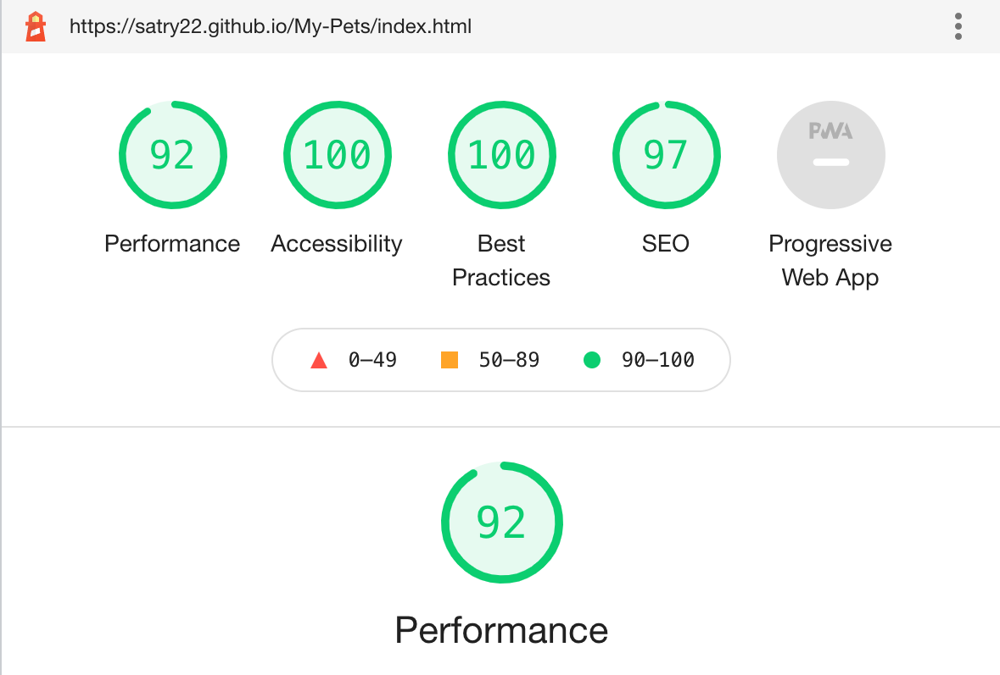
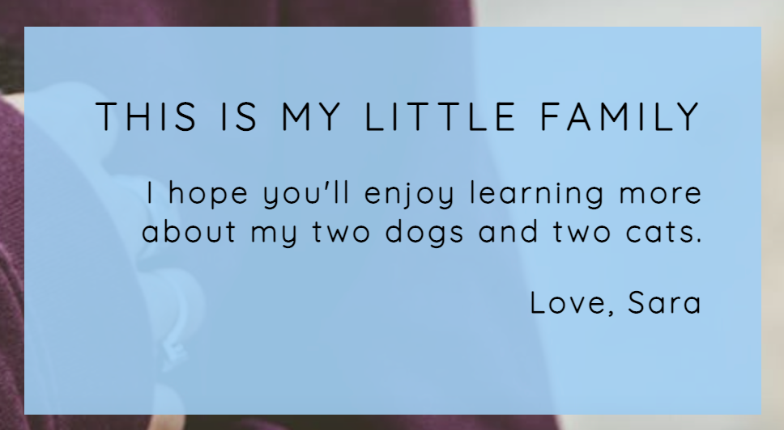

# Saras Pets

Saras Pets is at site to present my four pets, two dogs and two cats.
My friends and family love to follow them via social media, and this site is to give them, and new followers, an idea of who my pets are and where you can find out more about them.
Animals are wonderful creatures, and I love to share all the fun and sometimes not so fun things they are up to.

## User Experience

- __Design__

  - The design is simplistic and uses contrast colors to display the main content. It has a clear navigation menu and it is easy to go from one page to another.
  - The fonts are easy to read and contribute to a better user experience.

- __Initial Visual Idea__
  - Wireframes were created in [Balsamiq Wireframes](https://balsamiq.com/)

- __User Stories__

- As a user I want to know what the page is about.

- As a user I want to navigate between pages.

- As a user I want be able to view clear images of my pets.

- As a user I want to be able to sign up for a newletter to be caught up on what is new.

- As a user I want the social media links to work.

## Features 

- __Navigation Bar__

  - At the top of all four pages, the fully responsive navigation bar includes links to the Home page, the Gallery and a Sign Up page. It is identical in each page to allow for easy navigation.
  - This section will allow the user to easily navigate from page to page across all devices without having to revert back to the previous page via the ‘back’ button. 

- __The Header__

  - The main image is a photograph with text overlay to allow the user to briefly learn what the page is about. 
  - This section introduces the user to My Pets with an image of a little kitten.

- __All Pets__

  - This section present all the four pets. The user will learn a little bit about each personality.
  - This section will hopefully leave the user to want more.

- __Birthdays__

  - This section will allow the user to be reminded of when the pets birthdays are.  

- __The Footer__ 

  - The footer section includes links to social media sites for all the pets, viewing through the eyes of one of the dogs. The links will open to a new tab to allow easy navigation for the user. 
  - The footer is valuable to the user as it encourages them to keep connected via social media.

- __Gallery__

  - The gallery will provide the user with images to see what the newsletter and social media can look like. 
  - This section is valuable to the user as they will be able to easily identify the types of images posted on social media. 

- __The Sign Up Page__

  - This page will allow the user to get signed up to a weekly newsletter about the pets. The user will be able to choose if they want information on the dogs, the cats or both categories. The user will be asked to submit their full name and email address. 

- __The Thank You page__

- A thanks is given to the user as a confirmation on their signing up for the newsletter.

### Features Left to Implement

- A page with contact information.
- A page with a Facebook update.
- A blog.

## Technology

- Google Chrome was used in creating my project.

## Testing

### Validator Testing 

- HTML
  - No errors were returned when passing through the official [W3C validator](https://validator.w3.org/nu/?doc=https%3A%2F%2Fcode-institute-org.github.io%2Flove-running-2.0%2Findex.html)
- CSS
  - No errors were found when passing through the official [(Jigsaw) validator](https://jigsaw.w3.org/css-validator/validator?uri=https%3A%2F%2Fvalidator.w3.org%2Fnu%2F%3Fdoc%3Dhttps%253A%252F%252Fcode-institute-org.github.io%252Flove-running-2.0%252Findex.html&profile=css3svg&usermedium=all&warning=1&vextwarning=&lang=en#css)

  - Performance tested in Lighthouse:

  

## User Stories Testing

- As a user I want to know what the page is about.
  - The Title and the cover text of the page shows who I am and what my page is about.

   
  

- As a user I want to navigate between pages.
  - navigation links are at the top right. The page the user is on is identified by the underlined border on each link as the click through the website. Navigation is made easy at any par6t of the page, with a navigation bar that follows.

- As a user I want be able to view clear images of the pets.
  - When the user navigates to the Galley page the images of my pets are clearly laid out and visible to the user.

- As a user I want to be able to sign up for a newletter to be caught up on what is new.
  - The Sing Up page is laid out with a from in the center of the page under the Nav Bar. There are radio buttons where the user can choose what animals they prefer, or both.

- As a user I want the social media links to work.
  - Social media links work and are opened in a new window.

### Unfixed Bugs

No bugs unfixed. 

## Deployment

- The site was deployed to GitHub pages. The steps to deploy are as follows: 
  - In the GitHub repository, navigate to the Settings tab 
  - From the source section drop-down menu, select the Main Branch
  - Once the main branch has been selected, the page will be automatically refreshed with a detailed ribbon display to indicate the successful deployment. 

The live link can be found here - https://satry22.github.io/My-Pets/index.html 

## Credits 

  - Google fonts Quicksand and Open Sans was used on the entire page.
  - AwesomeFonts provided icons to Social Media Links and Birthdays.
  - W3School has been used for instruction and ideas for the overall page.
  - Basic structure inspiration from Love Running project.
  - Tutorials and instruction to form from The Code Institute.

### Content 

- All content written by Sara Tryzell.

### Media

- Images taken from [Pexels](https://pexels.com):
  Main Photo by Japheth Mast
  Black cat Photo by cottonbro
  Red cat Photo by Valeria Boltneva
  Cane Corso Photo by Vlad Chețan
  Yorkshire terrier Photo by Daria Rem
  Birthdays Photo by David Jakab
  Photo by Andrea Piacquadio

- All other photos are private. 

